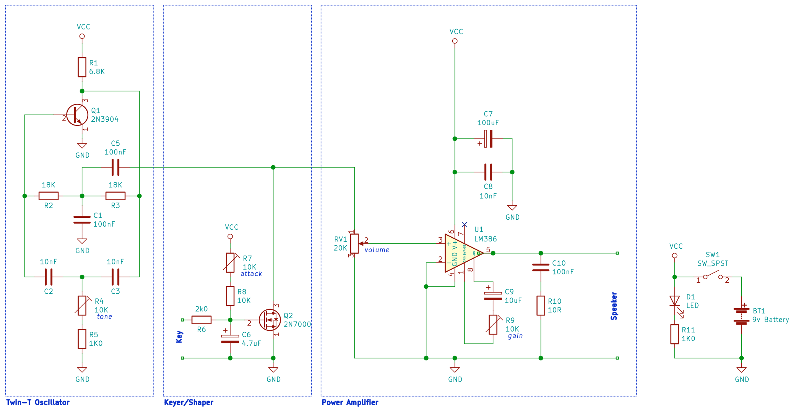

This is a further development of my Code Practice Oscillator (CPO).

Previous versions were:

* C1PO - a simple piezo buzzer version which sounded awful,
* C2PO - a better oscillator without amplifier - too soft
* C3PO - oscillator with shaped keying and LM386 amplifier - too loud

This version is called C4PO which ruins the reference to Star Wars.
I had hoped C3PO would be the last version!

The circuit for this is just bits and pieces borrowed from around the place.
This version has a volume control and a working tone (frequency) control.

The circuit is here:

This was built using Manhattan/Dead bug style.
