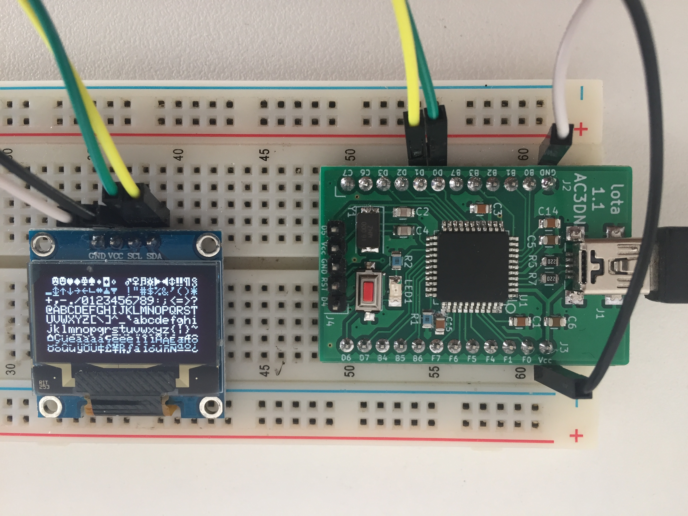

What is this?
=============

*Iota* is a minimal arduino-like clone of the
`Teensy 2.0 <https://www.pjrc.com/store/teensy.html>`_.
It is designed to be pin compatible with the Teensy without some of its features,
particularly:

* 5Volt circuit only
* mostly the same pinout as the Teensy

The aim is to not just get a working Teensy 2 clone, but to ensure that my
knowledge of how to build something like a Teensy is adequate.  Later the
Iota design will be embedded in designs such as the Headless VFO, a version
of DigitalVFO without the display and rotary encoder.

Design Documents
----------------

The *Misc* directory contains various documents:

* teensy_2.gif - the Teensy 2 schematic
* Teensy_2.0_pinout.png - the Teensy 2 pinout

The design of the *Iota* will start with the teensy_2.gif schematic.

Status
------

The 1.0 version was a bust.  The micro USB SMD mount components I ordered don't
match the component footprint I used on the PCB.  There's no way to bodge the
SMD components to fit the board, so onto version 1.1.

2019_04_03: The 1.1 board using an SMD mini B USB socket has arrived.  After
fiddling with the crystal loading capacitors (increased to 22pF) and burning a
bootloader into the CPU, IT WORKS!   Here's a picture of it running the Adafruit
GFX library demo using an little 128x64 OLED display from AliExpress:

I followed this procedure to
`bootload the AtMega32U4 <ihttps://murchlabs.com/monday-experiment-bootloading-an-atmega32u4-with-arduino/>`_.
